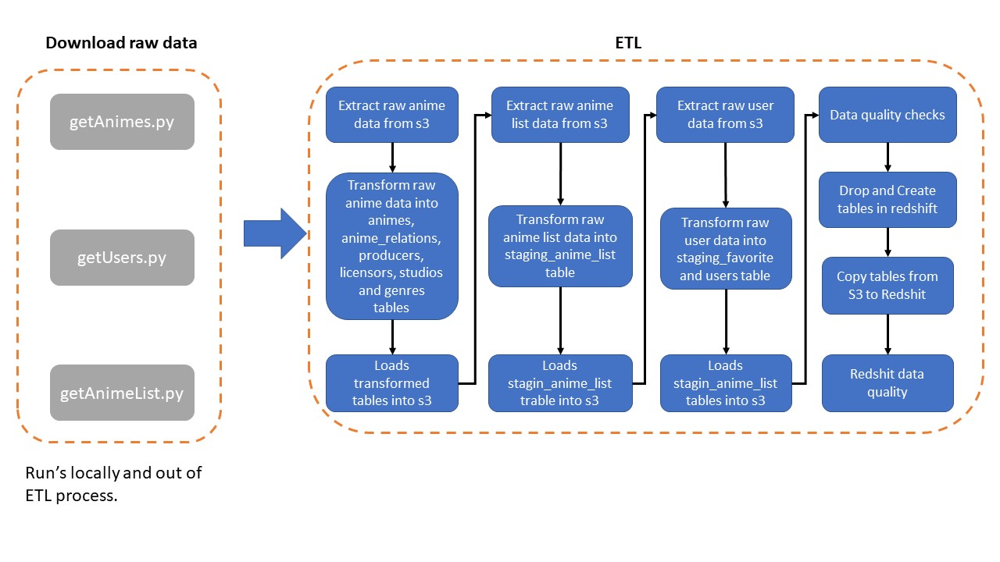

# PROJECT-CAPSTONE: My Anime List (MAL) Dataset

## Scope

This Project goal is to read data downloaded from My Anime List (MAL) site (https://myanimelist.net/) using an unofficial MAL REST API (https://jikan.docs.apiary.io/) and normalize it into the third form.

Project builds an ETL pipeline (Extract, Transform, Load) to extract data from the 3 raw sources listed below, process the data into fact and dimension tables. As technologies, Project-Capstone uses python, Amazon S3 and Redshit services. Input raw data is stored in S3, processed locally, saved into S3 and loaded into amazon redshift.

* **Anime Dataset** - Data about animes:
  * API URL: https://myanimelist.net/anime/'ID'.
  * Animes ID: It was used a list avaible on https://www.kaggle.com/azathoth42/myanimelist and incremented with new IDs that could be created since 2018 to create the file "ID_SEARCH.csv".
  * Based on then ID_SEARCH file and the API URL, the code "getAnimes.py" read the data from each one of the IDs and saves the raw data into several csv files.
  * Data structure and sample:

| Data             | Description                                               | Type                 |
| ---------------- | --------------------------------------------------------- | -------------------- |
| animeID          | Anime unique ID                                           | Integer              |
| request_cached   | True if the request is cached                             | Boolean              |
| title            | Anime original title                                      | Text                 |
| title_english    | Anime title in english                                    | Text                 |
| title_japanese   | Anime title in japanese                                   | Text                 |
| title_synonyms   | Anime title in synonyms                                   | List of Text         |
| image_url        | Url of image used on anime page                           | Text                 |
| type             | Anime type (TV, Movie, OVA, etc)                          | Text                 |
| source           | Anime sourece (Manga, Light Novel, etc)                   | Text                 |
| episodes         | Quantity of episodes                                      | Text                 |
| status           | Airing (1), finhished(2), Not yet aired (3)               | Integer              |
| airing           | True if anime is still airing                             | Boolean              |
| aired            | Initial and final airing data                             | Dictionary of date   |
| duration         | Duration of an episode or movie.                          | Text                 |
| rating           | Age rating                                                | Text                 |
| score            | Mean score geven by users                                 | Decimal              |
| scored_by        | Quantity of users that scored                             | Integer              |
| rank             | Rank position based on score                              | Integer              |
| popularity       | Rank position based on quantity of users that had watched | Integer              |
| members          | Quantity users that added anime to their lists            | Integer              |
| favorites        | Quantity users that added anime as favorite               | Integer              |
| background       | Background discrition                                     | Text                 |
| premiered        | Year and season that anime were aired                     | Text                 |
| broadcast        | Week day and our that anime were aired                    | Text                 |
| related          | Relation between animes, mangas and light novels          | Dictionary of lists  |
| producer         | Anime's producers                                         | List of Dictionaries |
| licensor         | Anime's licensors                                         | List of Dictionaries |
| studio           | Anime's studios                                           | List of Dictionaries |
| genre            | Anime's genres                                            | List of Dictionaries |
| opening_theme    | Anime's opening song                                      | List of Text         |
| ending_theme     | Anime's ending song                                       | List of Text         |

* **User Dataset** - Data about My Anime List users:
  * API URL: https://api.jikan.moe/v3/user/'username'.
  * username: It was used a sample of a list avaible on https://www.kaggle.com/azathoth42/myanimelist to create the file "users_filtered.csv".
  * Based on then users_filtered file and the API URL, the code "getUsers.py" read the data from each one of the users and saves the raw data into several json files.
  * Data structure:
  
| Data                 | Description                                            | Type                  |
| -------------------- | ------------------------------------------------------ | --------------------- |
| request_hash         | Request Hash                                           | Text                  |
| request_cached       | True if the request is cached                          | Boolean               |
| request_cache_expiry | Request cache expiry time                              | Integer               |
| user_id              | User unique ID                                         | Integer               |
| username             | User unique username                                   | Text                  |
| url                  | User's url page                                        | Text                  |
| image_url            | User's url profile image                               | Text                  |
| last_online          | Time stamp of user's last time online                  | Datetime              |
| gender               | User's gender                                          | Text                  |
| birthday             | User's birthday                                        | Date                  |
| location             | User's location                                        | Integer               |
| joined               | Date that user joined MAL                              | Date                  |
| anime_stats          | Stats based on user's anime list                       | Dictionary of decimal |
| manga_stats          | Stats based on user's manga list                       | Dictionary of decimal |
| favorites            | User's favorites animes, mangas, charcterss and people | Dictionary of list    |

{"request_hash": "request:user:19971671961534ea2816d830a22616663d4e1d27", "request_cached": true, "request_cache_expiry": 1107, "user_id": 10319955, "username": "phsvtw", "url": "https://myanimelist.net/profile/phsvtw", "image_url": null, "last_online": "2020-10-14T17:34:34+00:00", "gender": "Male", "birthday": "1994-05-30T00:00:00+00:00", "location": "Brazil", "joined": "2020-09-06T00:00:00+00:00", "anime_stats": {"days_watched": 149.9, "mean_score": 8.03, "watching": 18, "completed": 491, "on_hold": 3, "dropped": 1, "plan_to_watch": 34, "total_entries": 547, "rewatched": 0, "episodes_watched": 9064}, "manga_stats": {"days_read": 19.4, "mean_score": 8.76, "reading": 13, "completed": 11, "on_hold": 0, "dropped": 0, "plan_to_read": 21, "total_entries": 45, "reread": 0, "chapters_read": 3496, "volumes_read": 370}, "favorites": {"anime": [], "manga": [], "characters": [], "people": [{"mal_id": 2, "url": "https://myanimelist.net/people/2/Tomokazu_Sugita", "image_url": "https://cdn.myanimelist.net/images/voiceactors/2/60638.jpg?s=768f6805d5007cfd462154ebec0e7595", "name": "Sugita, Tomokazu"}]}, "about": null}

* **Anime List Dataset** - Data about list of animes that users watched, are watching or plan to watch:
  * API URL: https://api.jikan.moe/v3/user/'username'/animelist/all/'page'
  * username: It was used the "users_filtered.csv".
  * Each page has at most 300 registers of animes, so for users that have more then 300 animes in their list, it's necessary to check more then one page.
  * Based on then users_filtered file and the API URL, the code "getAnimeList.py" read the data from each one of the users anime list and pages and saves the raw data into several json files.
  * Data structure:

| Data                 | Description                            | Type                  |
| -------------------- | -------------------------------------- | --------------------- |
| request_hash         | Request Hash                           | Text                  |
| request_cached       | True if the request is cached          | Boolean               |
| request_cache_expiry | Request cache expiry time              | Integer               |
| anime                | Data about anime and user's anime list | List of Dictionary    |
 
{"request_hash": "request:user:bca432239503ac3e2b08bbd51a0c6d15f7468c53", "request_cached": true, "request_cache_expiry": 2772, "anime": [{"mal_id": 57, "title": "Beck", "video_url": "https://myanimelist.net/anime/57/Beck/video", "url": "https://myanimelist.net/anime/57/Beck", "image_url": "https://cdn.myanimelist.net/images/anime/11/11636.jpg?s=39346ef9c42e24eb49368e7d2d71ae20", "type": "TV", "watching_status": 2, "score": 10, "watched_episodes": 26, "total_episodes": 26, "airing_status": 2, "season_name": null, "season_year": null, "has_episode_video": false, "has_promo_video": true, "has_video": true, "is_rewatching": false, "tags": null, "rating": "R", "start_date": "2004-07-10T00:00:00+00:00", "end_date": "2007-07-03T00:00:00+00:00", "watch_start_date": "2009-01-04T00:00:00+00:00", "watch_end_date": "2009-05-04T00:00:00+00:00", "days": 5, "storage": "HD 250.0 Gb", "priority": "Low", "added_to_list": false, "studios": [], "licensors": []}, {"mal_id": 2167, "title": "Clannad", "video_url": "https://myanimelist.net/anime/2167/Clannad/video", "url": "https://myanimelist.net/anime/2167/Clannad", "image_url": "https://cdn.myanimelist.net/images/anime/1804/95033.jpg?s=47ebd401fb1cddabad1a9f100b436639", "type": "TV", "watching_status": 2, "score": 0, "watched_episodes": 23, "total_episodes": 23, "airing_status": 2, "season_name": null, "season_year": null, "has_episode_video": false, "has_promo_video": true, "has_video": true, "is_rewatching": false, "tags": null, "rating": "PG-13", "start_date": "2007-05-10T00:00:00+00:00", "end_date": "2010-04-03T00:00:00+00:00", "watch_start_date": null, "watch_end_date": null, "days": null, "storage": "EHD 250.0 Gb", "priority": "High", "added_to_list": false, "studios": [], "licensors": []}, {"mal_id": 4181, "title": "Clannad: After Story", "video_url": "https://myanimelist.net/anime/4181/Clannad__After_Story/video", "url": "https://myanimelist.net/anime/4181/Clannad__After_Story", "image_url": "https://cdn.myanimelist.net/images/anime/13/24647.jpg?s=afac554be69f5371fdc187edc529e8ea", "type": "TV", "watching_status": 2, "score": 10, "watched_episodes": 24, "total_episodes": 24, "airing_status": 2, "season_name": null, "season_year": null, "has_episode_video": false, "has_promo_video": true, "has_video": true, "is_rewatching": false, "tags": null, "rating": "PG-13", "start_date": "2008-03-10T00:00:00+00:00", "end_date": "2011-03-03T00:00:00+00:00", "watch_start_date": null, "watch_end_date": null, "days": null, "storage": "EHD 250.0 Gb", "priority": "High", "added_to_list": false, "studios": [], "licensors": []}]}

---

## Database

MAL database was modeled into a star schema, with 2 staging tables, 1 fact table and 7 dimensions tables:

### Staging Tables

* **staging_anime_list** is an intermediary data table, where the anime list of each user is stored. Watching_status domain is described on Jikan API site (https://jikan.docs.apiary.io

| Data             | Description                           | Type    |
| ---------------- | ------------------------------------- | ------- |
| username         | User unique username                  | Text    |
| animeID          | Anime unique id                       | Integer |
| watching_status  | User's status on anime watching       | Integer |
| score            | Anime's score given by the user       | Integer |
| watched_episodes | Anime's episodes watched by the user  | Integer |
| is_rewatching    | Flag if user is rewatching that anime | Boolean |
| watch_start_date | Date user started to watch the anime  | Date    |
| watch_end_date   | Date user finished to watch the anime | Date    |
| days             | Days spent watching the anime         | Integer |
| priority         | Anime's priority on user's list       | Text    |

* **staging_favorite** is an intermediary data table, list of favorites animes of each user is stored.

| Data             | Description                           | Type    |
| ---------------- | ------------------------------------- | ------- |
| username         | User unique username                  | Text    |
| animeID          | Anime unique id                       | Integer |

### Fact Table

* **anime_list** is the fact table, result of the join of the staging_anime_list and staging_favorite tables.

| Data             | Description                            | Type    |
| ---------------- | -------------------------------------- | ------- |
| username         | User unique username                   | Text    |
| animeID          | Anime unique id                        | Integer |
| watching_status  | User's status on anime watching        | Integer |
| score            | Anime's score given by the user        | Integer |
| watched_episodes | Anime's episodes watched by the user   | Integer |
| is_rewatching    | True if user is rewatching that anime  | Boolean |
| watch_start_date | Date user started to watch the anime   | Date    |
| watch_end_date   | Date user finished to watch the anime  | Date    |
| days             | Days spent watching the anime          | Integer |
| priority         | Anime's priority on user's list        | Text    |
| favorite         | True if anime is user's favorite liste | Boolean |

### Dimensions Table

* **animes** is the dimension table that contains animes data.

| Data          | Description                                               | Type    |
| ------------- | --------------------------------------------------------- | ------- |
| animeID       | Anime unique id                                           | Integer |
| title         | Anime original title                                      | Integer |
| title_english | Anime title in english                                    | Integer |
| type          | Anime type (TV, Movie, OVA, etc)                          | Text    |
| source        | Anime sourece (Manga, Light Novel, etc)                   | Text    |
| episodes      | Quantity of episodes                                      | Text    |
| status        | Airing (1), finhished(2), Not yet aired (3)               | Integer |
| duration      | Duration of an episode or movie.                          | Text    |
| rating        | Age rating                                                | Text    |
| score         | Mean score geven by users                                 | Decimal |
| scored_by     | Quantity of users that scored                             | Integer |
| members       | Quantity users that added anime to their lists            | Integer |
| favorites     | Quantity users that added anime as favorite               | Integer |
| aired_from    | Start date that anime was aired                           | Boolean |
| aired_to      | Finish date that anime was aired                          | Boolean |
| broadcast     | Week day and our that anime were aired                    | Text    |
| premiered     | Year and season that anime were aired                     | Text    |

* **anime_relations** is the dimension table that contains the relations between animes, mangas and light novels. The can be with the source (manga or light novel), sequel / prequel, side story and others.

| Data          | Description                                             | Type    |
| ------------- | ------------------------------------------------------- | ------- |
| animeID       | Anime unique id                                         | Integer |
| relation      | Relation description (sequel, prequel, side story, etc) | Text    |
| id_relation   | Id of title related to animeID                          | Integer |
| relation_type | Type of related ID (anime, manga, light novel, etc)     | Text    |

* **producers** is the dimension table that contains data about anime's producers.

| Data          | Description        | Type    |
| ------------- | ------------------ | ------- |
| animeID       | Anime unique id    | Integer |
| producer_id   | Producer unique id | Integer |
| producer_name | Producer name      | Text    |

* **licensors** is the dimension table that contains data about anime's licensors.

| Data          | Description        | Type    |
| ------------- | ------------------ | ------- |
| animeID       | Anime unique id    | Integer |
| licensor_id   | Licensor unique id | Integer |
| licensor_name | Licensor name      | Text    |

* **studios** is the dimension table that contains data about anime's studios.

| Data        | Description      | Type    |
| ----------- | ---------------- | ------- |
| animeID     | Anime unique id  | Integer |
| studio_id   | Studio unique id | Integer |
| studio_name | Studio name      | Text    |

* **genres** is the dimension table that contains data about anime's genres.

| Data       | Description     | Type    |
| ---------- | --------------- | ------- |
| animeID    | Anime unique id | Integer |
| genre_id   | Genre unique id | Integer |
| genre_name | Genre name      | Text    |

* **users** is the dimension table that contains data about MAL users.

| Data        | Description                           | Type     |
| ----------- | ------------------------------------- | -------- |
| user_id     | User unique ID                        | Integer  |
| username    | User unique username                  | Text     |
| last_online | Time stamp of user's last time online | Datetime |
| gender      | User's gender                         | Text     |
| birthday    | User's birthday                       | Date     |
| location    | User's location                       | Integer  |
| joined      | Date that user joined MAL             | Date     |

### DB schema

### About the data

#### What info is possible to get from that data?

* What are the most popular animes?
* What are the most popular animes by season?
* Based on the animes that an user watched, what other anime is recommended?
* What are the most popular genres?
* What are the favorites genres of an given user?
* Mean score of producers, licensors and studios?

#### Missing data

MAL is a site that take input/update of some of the data based on user input, it shows a lot of missing data, mainly in animes that are not popular. It's common to see animes without data about **producers, licensors, studios and etc**.

The **anime_list** dataset shows the same problem. Data like score, watched_episodes, watch_start_date and watch_end_date are not required to add an anime to an anime list, that is why it shows a lot of missing data.

## ETL

### Purpose of the database and ETL pipeline

The output is meant to be used to analytics means, simple querys and fast aggregations.

### ETL pipeline design

---

## HOWTO use

* **dwh.cfg**:
    * AWS:
        * KEY - Key to access AWS services
        * SECRET - Secret to access AWS services
    * CLUSTER
        * HOST - Endpoint of redshift cluster
        * DB_NAME - Redshift DB name
        * DB_USER - Redshift DB user
        * DB_PASSWORD - Redshift DB password
        * DB_PORT - Redshift DB port
    * IAM_ROLE
        * ARN - ARN added to redshift cluster
    * S3
        * BUCKET - Bucket where raw and transformed data are stored
        * REGION - Bucket's region
        * ANIME_INPUT - Path inside bucket where anime raw data are stored
        * ANIME_OUTPUT - Path inside bucket where anime transformed data are stored
        * ANIME_LIST_INPUT - Path inside bucket where anime list raw data are stored
        * ANIME_LITS_OUTPUT - Path inside bucket where anime list transformed data are stored
        * USER_INPUT - Path inside bucket where user raw data are stored
        * USER_OUTPUT - Path inside bucket where user transformed data are stored

* **etl.py**: This ETL pipeline script uses data stored in Amazon AWS S3, processes and cleans data, and writes the processed data into a Redshift cluster.

* **sql_queries.py**: Contain all sql queries used on etl.py

### Prerequisites

* **Python3** is recommended as the environment.

* **libraries**:
    * configparser
    * psycopg2
    * pandas
    * literal_eval (from ast)
    * parse (from dateutil.parser)
    * boto3
    * io
    * time
    * sys

### Run ETL pipeline

Type to command line:

`python3 etl.py`

* Script reads in configuration settings (dwh.cfg) to get bucket and path that raw data is stored and where to output de transformed data
* Using pandas dataframe, transform anime raw data into animes, anime_relations, producers, licensors, studios and genres csv files and save them into S3 output path.
* Using pandas dataframe, transform anime list raw data into staging_anime_list csv files  and save them into S3 output path. Anime list does not have username data, but is possible to get it based on the json files names.
* Using pandas dataframe, transform user raw data into staging_favorite and users csv files  and save them into S3 output path.
* Runs quality check based on quantity of registers copied into S3 output and quantity of registers on Redshift tables.
* Passing quality checks copy csv files from S3 into Reshift tables.

---

## Project write-up

**Rationale for the tools selection:**

* Python and Pandas were choose to process project's input data because it contains all necessary (and easy to use) libraries to read, clean, process, and form DB tables. Since data were not normalized, spark was not used.
* S3 were used to store input data to facilitate read and write process.
* AWS redshif were choose because it facilited the data modeling and querying process.

**How often ETL script should be run:**

* ETL process depend on the download data from MAL site. Beacuse the API it's unofficial and has a serie of limitations, the programs to download the data could take about four days to process (3 days to all anime data and 1 day to process 4 thousand of users).
* Considering an improviment of the API performance or an way to find only users / animes that had been update, the process should run daily (weekly on worst scenery).

**Other scenarions (what to consider in them):**

* Data is 100x:
  * Data is already stored in AWS S3.
  * AWS Redshift is already benn used to final tables.

* Data is used in dashboard and updated every day 07:00AM:

  * ETl script should be refactored to process only the changed inout information instead of processing all the inout files as it does now to minimise the used time and computing resources.

* DB is accessed by 100+ people:
  * Output data should be stored in a Cloud DB (e.g. AWS RDS) to make it "always available" for further analysis.

**Potential further work:**

* Improve API process to bear more access
* Parallelize the download data process
* Create an event table / process to select only animes or users that had an update to use as entering of the download process
* Implement airflow pipe process
* Include more data, like animes reviews, staff, characters and etc.

---

## Final Considerations

* The process of download data from MAL is not the main goal of this capstone project. The ETL runs based on the principle that the raw data has already been downloaded.
* Because the time spent downloading data it were used just some sample off users
* API and MAL site had shown constantly intermittence and in order to overcome that problem, it was choose to download contents of user and anime list into separated json files. The choise of keep anime dataset into csv was based on the requirement of the capstone projetc to use at least 2 different data formats.
* Some of anime data is obtained by grooping data for all users' anime list (scored, members, etc). Since the project works with an sample of users, it has been decided to keep the original total amount of that data.
* Dued time to download all data, in this project it was decided to download it locally and then load into S3. In a real and optimized process, the data would be donwload directly to an S3 bucket.
* ETL took 3 and half hours to process completely. For more details check log.md
* All data used is public
