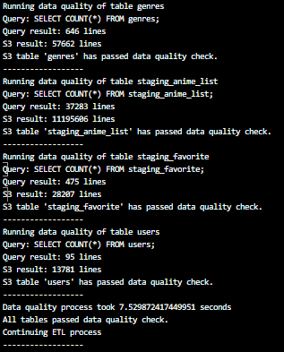
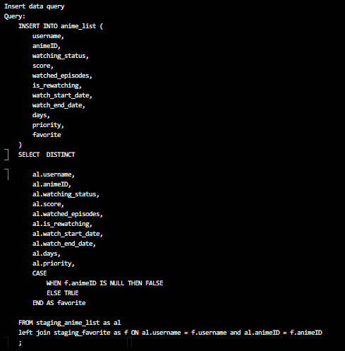

# Log details

## S3 Conection and transform process

## Create table (first time)

## Data Quality

obs: The total quantity of lines in S3 is summed 10.000 on dimensions tables and favorites staging tables. On staging anime list table it is summed 10.000.000. It had ocurred during some tests in data quality check. Correct total ammount is:

* animes - 16.938
* anime_relations - 23.428
* producers - 18.640
* licensors - 4.307
* studios - 10.328
* genres - 47.662
* staging_anime_list - 1.195.606 
* staging_favorite - 18.207
* users - 3.781

## Drop old redshift tables and create new ones

## Copy from S3 to Redshift

## Insert data into Fact table

## Redshift data quality

## Final

